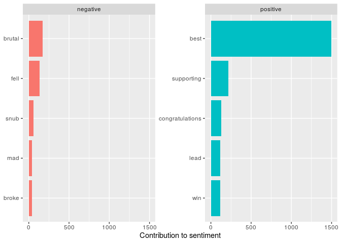

Oscar Nomination Sentiment
================
Lucy D’Agostino McGowan

``` r
library(rtweet)
library(tidytext)
library(tidymodels)
library(tidyverse)
```

``` r
tweets <- search_tweets("#OscarNominations", n = 4000)
tweets <- tweets %>%
  select(user_id, status_id, created_at, screen_name, text, is_quote, is_retweet,
         favorite_count, retweet_count)
write_csv(tweets, "data/tweets.csv")
```

``` r
tweets <- read_csv("data/tweets.csv")
```

    ## Parsed with column specification:
    ## cols(
    ##   user_id = col_double(),
    ##   status_id = col_double(),
    ##   created_at = col_datetime(format = ""),
    ##   screen_name = col_character(),
    ##   text = col_character(),
    ##   is_quote = col_logical(),
    ##   is_retweet = col_logical(),
    ##   favorite_count = col_double(),
    ##   retweet_count = col_double()
    ## )

``` r
sentiments <- tweets %>%
  unnest_tokens(word, text) %>%
  inner_join(get_sentiments("bing"), by = "word") %>%
  count(word, sentiment, sort = TRUE) %>%
  ungroup()
```

``` r
sentiments %>%
  filter(!(word %in% c("joker", "parasite"))) %>%
  group_by(sentiment) %>%
  top_n(5, wt = n) %>%
  ungroup() %>%
  mutate(word = reorder(word, n)) %>%
  ggplot(aes(word, n, fill = sentiment)) +
  geom_col(show.legend = FALSE) +
  facet_wrap(~sentiment, scales = "free_y") +
  labs(y = "Contribution to sentiment",
       x = NULL) +
  coord_flip()
```

<!-- -->
